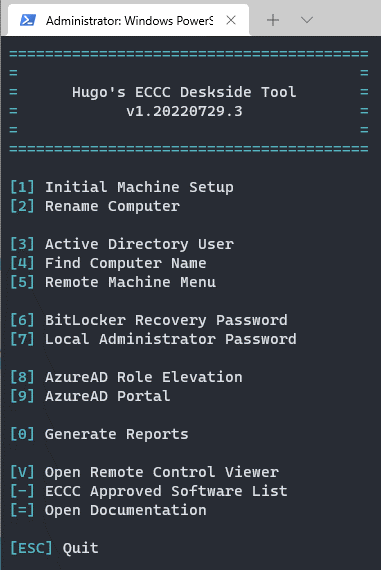

# Deskside Tool 🔧

An all-in-one PowerShell script that assembles and automates common Deskside Technician tasks & tools

## Requirements

- PowerShell 5.1
- A user account with admin privileges for the following:
    - RSAT
    - Active Directory
    - SCCM
    - Azure AD
- The following PowerShell modules (will be automatically installed when required):
    - ActiveDirectory
    - [ImportExcel](https://www.powershellgallery.com/packages/ImportExcel)
    - [AzureADPreview](https://www.powershellgallery.com/packages/AzureADPreview)
- [Windows Terminal](https://apps.microsoft.com/store/detail/windows-terminal/9N0DX20HK701) (Optional, but makes the console look cuter)

## Setup
Modify the variables under the Variables header in the script to suit your environment

## Usage

Create a shortcut with `powershell.exe -noexit -ExecutionPolicy Bypass -File path\to\dstool.ps1` and run shortcut as admin

OR

Run PowerShell in admin -> Enter `& path\to\dstool.ps1`

## Updates

Every time the main menu is loaded, it will do a version check with the file saved on the network drive. (May change this to check this repo for updates in the future) If a newer version is found, a message will be displayed under the banner. Press U while on the main menu to update to the latest version.

## Features

1. **Initial Machine Setup**
    - Executes a separate script on newly imaged machines to apply patches/fixes as to what the image or task sequence missed. This is specific to only our images and the script will not be included as such.
2. **Rename Computer**
    - Renames a remote computer with option of restarting. If restarting is elected, BitLocker will be suspended for 1 reboot so that the computer can be accessed remotely after.
3. **Active Directory User**
    - Submenu that features the following:
        1. **User Information**
            - Queries AD and returns attributes relating to the user
        2. **Group Memberships**
            - Queries AD and returns name and description of all groups the user is a member of
        3. **Reset Password**
            - Changes user's password. Requirements are 8 characters, 1+ uppercase, 1+ lowercase, 1+ number, 1+ non-alphanumeric character, and does not contain the user's display name or SamAccountName
        4. **Unlock Account**
            - Unlocks the user's account if it becomes locked due to too many incorrect password attempts
4. **Find Computer Name**
    - Queries SCCM and returns all machines that has the Primary User, Current Logged on User, or Last Logged on User as the given user.
5. **Remote Machine Menu**
    - Submenu that features the following scripts to be executed on a remote computer:
        1. **System Info**
            - Returns the Boot, Machine/Device Specs, OS, Storage Info, and currently connected monitors 
        2. **Installed Programs**
            -  Queries registry for local machine installs + current user's registry and returns list of installed programs with their info
        3. **c$**
            -  Opens file explorer to \\\\computername\c$ of remote computer
        4. **Transfer Files**
            -  Transfers selected files to C:\temp of remote computer
        5. **Map Network Drive**
            - Remotely maps a network drive by creating a scheduled task under the logged on user and running it immediately. Will pick the next available drive letter ascending from Z
        6. **Map Network Printer**
            -  Remotely adds a network printer by creating a scheduled task under the logged on user and running it immediately
        7. **GPUpdate**
            - Runs gpupdate /force on remote computer
        8. **McAfee Agent Actions**
            - Runs Collect and Send Props, Send Events, Check New Policies, and Enforce Policies
        9. **Configuration Manager Actions**
            - Runs MachinePolicy, AppDeployment, HardwareInventory, UpdateDeployment, UpdateScan, and SoftwareInventory
        10. **Clear CCM Cache**
            - Clears CCM cache by running Control Panel > Configuration Manager > Cache Tab > Delete Files
        11. **Clear MSTeams Cache**
            - Removes the cache storing folders found in C:\Users\*\AppData\Roaming\Microsoft\Teams
        12. **Remote Control Viewer**
            - Opens the SCCM Remote Control Viewer and immediately connects/sends a request to the remote machine.
        13. **Deploy DisplayLink**
            - Installs DisplayLink onto the remote machine and adds the all .inf files found in C:\Program Files\DisplayLink Core Software\Drivers to the driver store
        14. **Deploy McAfee FRP**
            - Installs McAfee File and Removable Media Protection module onto the remote machine. Upon a successful installation, the machine will require a reboot. A Windows toast notification will be sent to the machine advising the user to do so
        15. **Lock Workstation** (Hidden)
            - Sends a scheduled task to run immediately to lock the workstation
6. **BitLocker Recovery Password**
    - Queries AD for the BitLocker Recovery Password using either the computer name or recovery ID key
7. **Local Administrator Password**
    - Queries AD for the local administrator password found in the computer's attribute properties 
8. **AzureAD Role Elevation**
    - Script that allows you to elevate Azure AD account privileges. The following roles are available as options:
      - Authentication Admin (MFA)
      - Reports Reader
      - Security Reader
9. **AzureAD Portal**
    - Links to Azure AD portal
0. **Generate Reports**
    - Submenu that features report generation to Excel. Only whitelisted users will be able to use this option.
        1. **Machine Data**
            - Queries SCCM and returns a report of machine data for all machines in the specified region. This includes system info such as computer name, last logon user and time, SCCM version, OS version, device manufacturer/model/serial number
        2. **Machines Active Monitor Info**
            - Remotely executes a command on all online machines in the specified region to retrieve its connected monitors' information. Includes Manufacturer, Model, and Serial Number.
        3. **Machines with Specified Software Installed**
         	- Queries SCCM and returns a report of all machines in the specified region that has the given software installed
        4. **Machines without Specified Software Installed**
            - Queries SCCM and returns a report of all machines in the specified region that don’t have the given software installed
        5. **Client Status Check**
            - Queries SCCM and returns a report of the information found in the Client Check Detail tab of SCCM for all machines in the specified region
        6. **SCCM Health Check**
            - Remotely executes a command on all online machines in the specified region to retrieve their SCCM health check result found in the C:\Windows\CCM\CcmEvalReport.xml file. 
        7. **BitLocker Status**
            - Remotely executes a command on all online machines in the specified region to retrieve their BitLocker status on the C: drive
        8. **SCCM and SAP Comparison Report**
            - Queries SCCM and compares it with given SAP report
            - Returns a report of machines with any of the following dissimilarities:
                - Serial number mismatches
                - Custodian does not match Primary or Current User
                - Primary User does not match Current User
        
